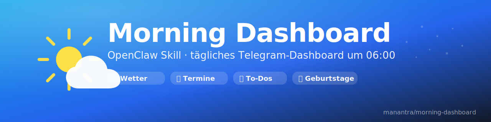

<p align="center">
  
</p>

# Morning Dashboard

Ein OpenClaw-Skill für tägliche Briefings: Wetter, Termine, To-dos, Geburtstage.

## Features

- **Wetter** via Open-Meteo API (Rathenow als Standard)
- **Kalender** via khal
- **To-dos** aus lokalen Markdown-Dateien
- **Geburtstage** 7-Tage-Vorschau aus JSON
- **Zeitabhängiger Gruß** (Guten Morgen, Mahlzeit, Guten Tag, etc.)
- **Image-Dashboard** als PNG (1080×2340 für moderne iPhones)
- **Text-Fallback** wenn Pillow nicht verfügbar

## Installation

1. Skill-Ordner in OpenClaw Skills kopieren:
   ```bash
   cp -r morning-dashboard ~/.openclaw/skills/
   ```

2. Python-Dependencies (für Image-Dashboard):
   ```bash
   pip install Pillow
   ```

3. Externe Tools:
   - `khal` für Kalender
   - `curl` für Wetter-API

## Verwendung

**Trigger-Phrasen:**
- "Dashboard" / "Mein Dashboard"
- "Was steht heute an?"
- "Tagesübersicht"
- "Zeig mir meinen Tag"

**Cron (empfohlen):**
```bash
0 6 * * * /path/to/venv/bin/python morning_dashboard.py
```

## Konfiguration

Umgebungsvariablen:
- `DASH_STYLE`: `cards` (default) oder `list`
- `DASH_THEME`: `dark` (default) oder `light`
- `DASH_ICONS`: `on` (default) oder `off`

Telegram Bot Token aus `~/.openclaw/openclaw.json` oder `TELEGRAM_BOT_TOKEN` env.

## Dateipfade (anpassen!)

- To-dos: `/home/clawd/clawd/todos/YYYY-MM-DD.md`
- Geburtstage: `/home/clawd/clawd/data/people/birthdays.json`
- Fonts: `/home/clawd/clawd/assets/fonts/DejaVuSans.ttf`

## License

MIT
